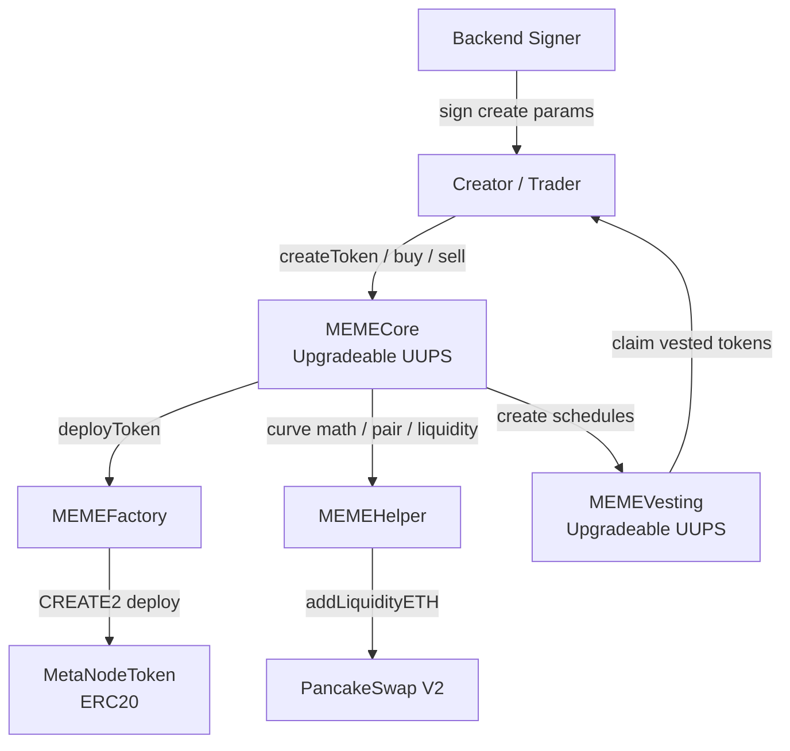
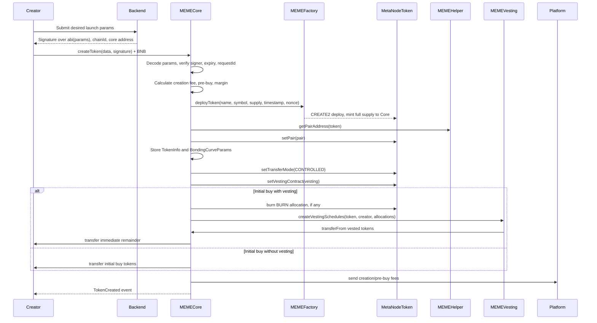
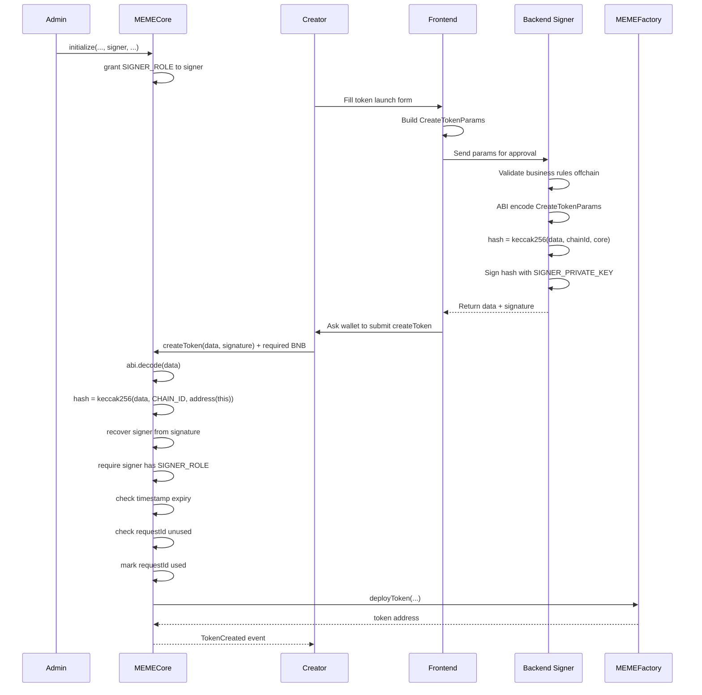
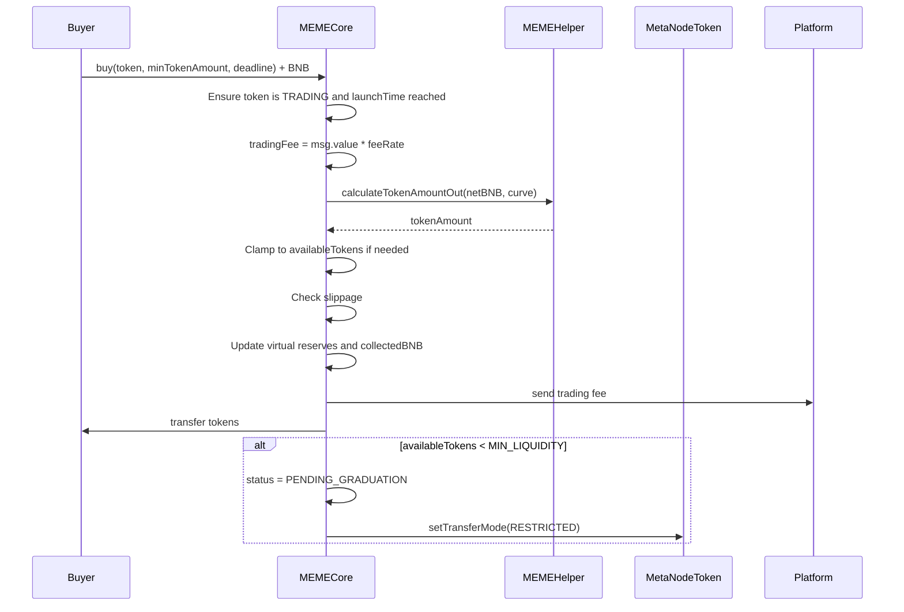
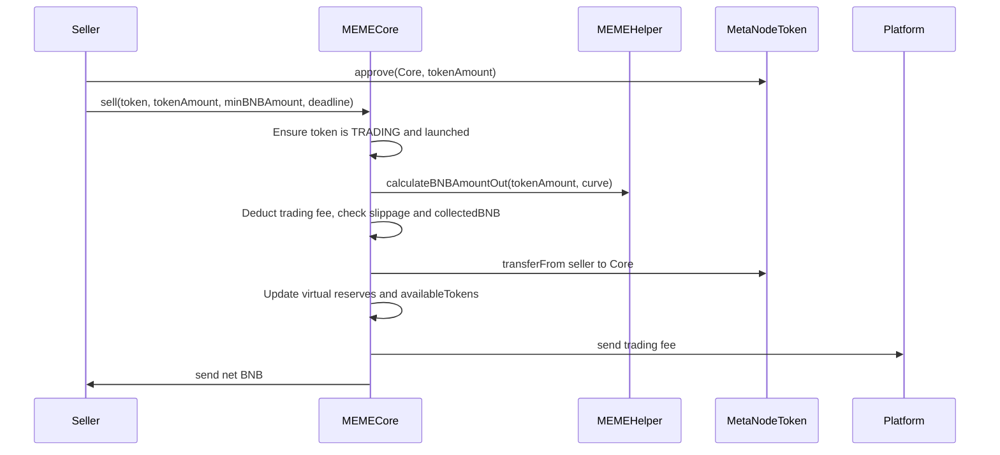
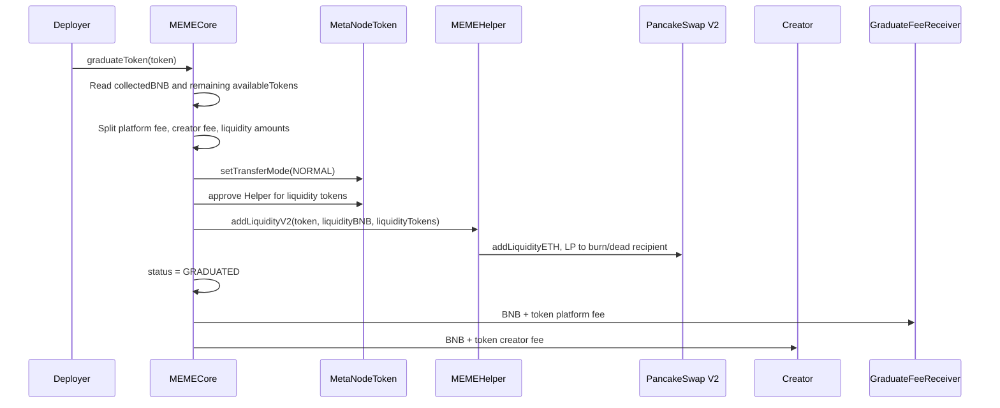
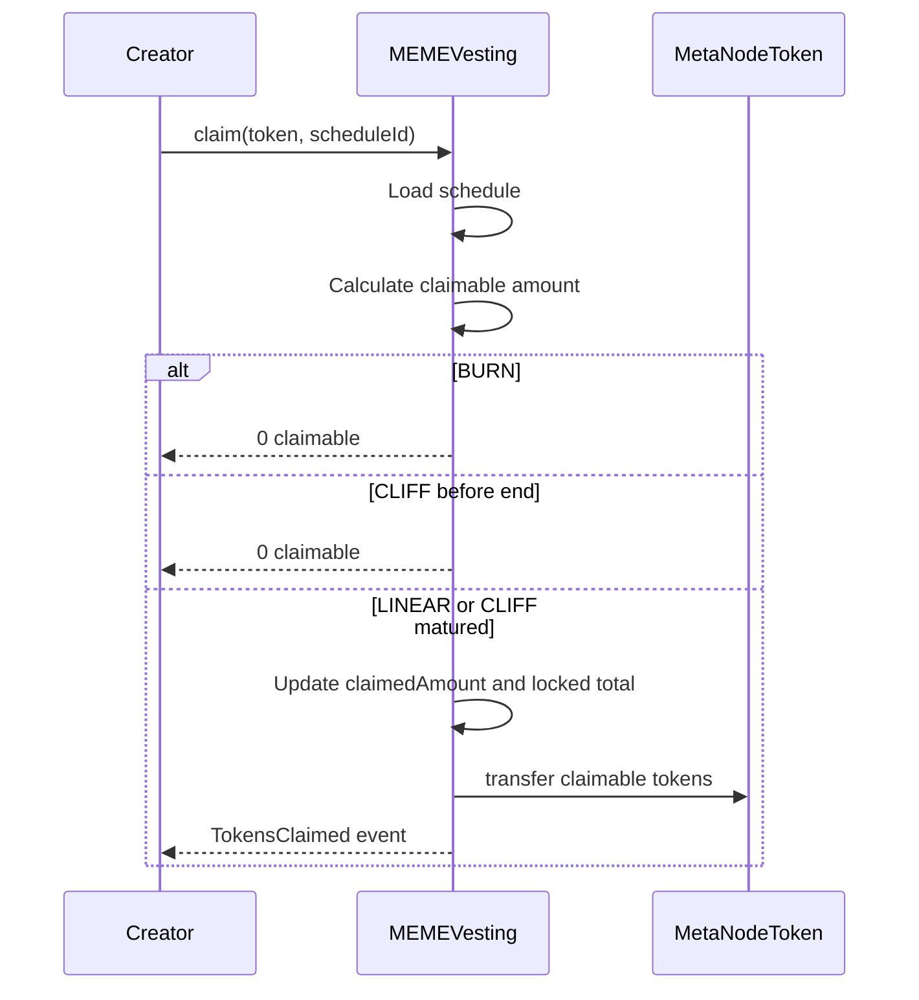

# MEME Launchpad
## Overview
It is a Foundry-based MEME token launchpad where MEMECore manages token creation, bonding-curve trading, vesting, and graduation into PancakeSwap-style liquidity.
Core files:
- MEMECore.sol: the launchpad ledger and rule engine, main lifecycle contract.
- MEMEFactory.sol: deploys new ERC20 tokens with `CREATE2`.
- MEMEToken.sol: launched ERC20 token with transfer restrictions until graduation.
- MEMEHelper.sol: bonding curve math and PancakeSwap v2 liquidity helper.
- MEMEVesting.sol: holds locked creator allocations.

## Architecture

- `MEMECore` is the brain. It stores token state, validates backend signatures, charges fees, initializes bonding curves, handles buys/sells, manages graduation, and controls pause/blacklist states.
- `MEMEFactory` is deliberately small. Only addresses with `DEPLOYER_ROLE`, normally `MEMECore`, can call `deployToken`. It uses `CREATE2`, so token addresses can be predicted before deployment.
- `MetaNodeToken` is the ERC20 that gets deployed per launch. It starts in restricted mode, then controlled mode during bonding-curve trading, then normal mode after graduation. The key transfer modes are defined in `MEMEToken.sol` (line 44).
- `MEMEHelper` contains the constant-product math: k = virtualBNBReserve * virtualTokenReserve. Buying increases virtual BNB reserve and decreases virtual token reserve; selling does the reverse.
- `MEMEVesting` stores schedules by `token -> beneficiary -> scheduleId`. It supports `BURN`, `CLIFF`, and `LINEAR` modes from `IVestingParams.sol` (line 25).
## Bonding Curve
The bonding curve here is a temporary AMM before the token "graduates" to PancakeSwap.

                    Bonding Curve: x * y = k

      Token reserve y
      ^
      |
      |     Start
      |      *
      |       \
      |        \
      |         \
      |          \
      |           \
      |            *  After creator initial buy
      |             \
      |              \
      |               \
      |                *  After public buys
      |
      +------------------------------------------------> BNB reserve x


      x = virtualBNBReserve
      y = virtualTokenReserve
      k = x * y
      price = x / y

      As x increases, y decreases.
      As users buy, price goes up.

- For a buy

Before buy:
```
    x0 = virtualBNBReserve
    y0 = virtualTokenReserve
    k  = x0 * y0
```
User pays BNB: `bnbIn = amount paid into curve`

After buy:
```
    x1 = x0 + bnbIn
    y1 = k / x1 (y1 < y0)
```
Tokens received: `tokensOut = y0 - y1`

- So as users buy more:
```
virtualBNBReserve (x) goes up
virtualTokenReserve (y) goes down
price (x / y) goes up
availableTokens goes down
collectedBNB goes up
```

## Timeline flows
### Token Creation Sequence

The main entry point is `MEMECore.createToken (line 385)`. Important checks happen there: signature validity, one-time requestId, sale amount validity, max initial buy 9990 basis points, and payment sufficiency.
One subtle but important design choice: the created token mints the entire supply to `MEMECore`, not the creator. The core contract then releases tokens according to launch rules.

### Offchain Approval for Token Creation
The backend signer is offchain approval authority for `MEMECore.createToken`. Creator's wallet submits the signed payload to `MEMECore`. The contract verifies the request payload was signed by an address that has `SIGNER_ROLE` in `MEMECore`.

So the flow is:
1. `Deploy` script initializes `MEMECore` with tokenomics params and roles (including signer for `MEMECore.createToken`) 
2. `Backend` Signs message using private key.
3. `MEMECore`
    - Recovers signer address.
    - Checks if recovered address have `SIGNER_ROLE`, If yes: request approved; otherwise: revert

This pattern is powerful because the backend can dynamically approve launches by signing **without** storing everything onchain:
```solidity
mapping(address => bool) approved;
```


### Vesting
Real token launches often want mixed rules, for example:
```
Initial buy = 10% of total supply

2% burn forever
3% cliff unlock after 30 days
3% linear unlock over 90 days
2% sent immediately
```
That needs multiple allocations:
```solidity
[
    { amount: 200, mode: BURN,   duration: 0 },
    { amount: 300, mode: CLIFF,  duration: 30 days },
    { amount: 300, mode: LINEAR, duration: 90 days }
]
```

### Buy Sequence

The buy path is `MEMECore.buy (line 566)`. The math lives in `MEMEHelper.calculateTokenAmountOut (line 285)`.

### Sell Sequence

The sell path is `MEMECore.sell (line 669)`.

### Graduation Sequence

Graduation is `MEMECore.graduateToken (line 750)`. Once graduated, token transfers become normal ERC20 transfers and trading moves to the DEX.

### Vesting Claim Sequence

The vesting calculation is in `MEMEVesting.sol (line 349)`. LINEAR uses elapsed time over total duration; CLIFF releases everything only after endTime; BURN never becomes claimable.

### Solidity Hooks
A `hook` is a function that is automatically called before or after some important action, so child contracts can customize behavaior.
Examples: OpenZeppelin uses hooks around token transfers, minting and burning.
```solidity
ERC20 OZ v4:
_beforeTokenTransfer(...)
_afterTokenTransfer(...)

ERC20 OZ v5 (override _update):
_update(...)

ERC721:
_beforeTokenTransfer(...)
_afterTokenTransfer(...)
```
```solidity
MEMEToken.sol line 219:

function _beforeTokenTransfer(address from, address to, uint256 amount) internal virtual override {
    super._beforeTokenTransfer(from, to, amount);

    // 规则1：允许铸造和销毁
    if (from == address(0) || to == address(0)) {
        return;
    }

    // 规则2：禁止转账到代币合约自身
    if (to == address(this)) {
        revert TransferToTokenNotAllowed();
    }

    // 规则3：归属合约转出始终允许
    if (from == vestingContract && vestingContract != address(0)) {
        return;
    }

    // 规则4：非 NORMAL 模式禁止转入 pair
    if (transferMode != TransferMode.MODE_NORMAL && to == dexPair && dexPair != address(0)) {
        revert TransferNotAllowedToPair();
    }

    // 规则5：RESTRICTED 模式禁止所有转账
    if (transferMode == TransferMode.MODE_TRANSFER_RESTRICTED) {
        revert TransferRestricted();
    }
}
```


---

# MetaNode 线性归属功能文档

## 概述
MetaNode 平台现在支持初始代币购买的线性归属（Linear Vesting）功能。该功能允许代币创建者锁定其部分初始购买的代币，并设定自定义的归属时间表，随着时间的推移线性释放代币。

## [点击这里看启动脚本](./START.md)

🔗 在 BSCScan 查看
MetaNodeCore Impl: https://testnet.bscscan.com/address/0x417C4502ddC0cD9100846779a519538DaD633d00#code   
MEMEFactory: https://testnet.bscscan.com/address/0x7A24756A156DE5752a2d91d494D2D4FdCc9fc18F#code   
MEMEHelper: https://testnet.bscscan.com/address/0xbdBA43Fa0DF71724E5fF171eD3F4781ece0c141A#code   
MEMEVesting Impl: https://testnet.bscscan.com/address/0x86A15A5e88a78628C89b8308773eD51bD96Ec3db#code   
MetaNodeToken: https://testnet.bscscan.com/address/0x34321291a4ab6b1fcc38d28c9512752536f7f67f#code  
 
 
## 📍 新创建的代币地址
代币	地址	BSCScan
Token1 (Simple)	0x12bBa5DB3DCb373216B636b01F1472948CD9d69b	查看
Token2 (InitialBuy)	0x96060d0b291284e6b7D4ccffBB8656c11348B6Bf	查看
Token3 (Vesting)	0x0c0FE9b6AF42999FE16d0ABE9aEF6681C78ca7Fe	查看
## 📍 已部署的代理合约地址
合约	代理地址	实现地址
MetaNodeCore	0x69207F321CFDfd30D73D1d9278e4132E15080ec9	0x417C4502ddC0cD9100846779a519538DaD633d00
MEMEVesting	0x99Cd9cA83277338583F40d6b689c0aA5E20baCAD	0x86A15A5e88a78628C89b8308773eD51bD96Ec3db
合约	地址
MEMEFactory	0x7A24756A156DE5752a2d91d494D2D4FdCc9fc18F
MEMEHelper	0xbdBA43Fa0DF71724E5fF171eD3F4781ece0c141A


## 架构

### 系统组件
```
┌──────────────────┐      ┌──────────────────┐      ┌──────────────────┐
│  MetaNodeCore    │─────▶│ MetaNodeVesting  │◀─────│     User         │
│  (代币创建)       │      │ (线性释放)       │      │    (领取)        │
└──────────────────┘      └──────────────────┘      └──────────────────┘
         │                         │
         ▼                         ▼
┌──────────────────┐      ┌──────────────────┐
│  MetaNodeToken   │      │ 归属时间表        │
│   (ERC20)        │      │   管理           │
└──────────────────┘      └──────────────────┘
```

### 合约集成
- **MetaNodeCore**: 修改以支持代币创建期间的归属分配
- **MetaNodeVesting**: 新的可升级合约，用于管理归属时间表
- **IMetaNodeVesting**: 定义归属操作的接口
- **IMetaNodeCore**: 更新了 `VestingAllocation` 结构体

## 功能特性

### 1. 多重归属时间表
用户可以将初始代币购买分成多个部分，每个部分都有自己的归属期限：
- 没有最短或最长时间限制
- 每个时间表从开始到结束时间线性释放代币
- 每次代币创建支持任意数量的归属时间表

### 2. 灵活分配
- 以基点指定归属金额（0-10000 = 0%-100%）
- 剩余代币立即转移
- 总归属分配不能超过 100%

### 3. 线性释放机制
```
已归属金额 = (总金额 × 经过的时间) / 总持续时间
可领取金额 = 已归属金额 - 已领取金额
```

### 4. 领取选项
- **单独领取**: 从特定的归属时间表领取
- **全部领取**: 领取所有时间表中所有可用的代币
- **实时计算**: 基于当前时间戳计算可领取金额

## 使用方法

### 创建带有归属的代币

使用 `createToken` 创建代币时，包含归属分配信息：

```solidity
IMetaNodeCore.VestingAllocation[] memory vestingAllocations = new IMetaNodeCore.VestingAllocation[](3);

// 30% 归属期 1 天
vestingAllocations[0] = IMetaNodeCore.VestingAllocation({
    amount: 3000,      // 30% (基点)
    duration: 86400    // 1 天 (秒)
});

// 50% 归属期 1 周
vestingAllocations[1] = IMetaNodeCore.VestingAllocation({
    amount: 5000,      // 50%
    duration: 604800   // 1 周
});

// 20% 立即释放 (无需归属，自动计算)
// 剩余的 20% 将立即转移

IMetaNodeCore.CreateTokenParams memory params = IMetaNodeCore.CreateTokenParams({
    // ... 其他参数 ...
    initialBuyPercentage: 1000,  // 10% 初始购买
    vestingAllocations: vestingAllocations
});
```

### 领取已归属代币

用户可以通过 MetaNodeVesting 合约领取已归属的代币：

```solidity
// 从特定时间表领取
uint256 claimed = vesting.claim(tokenAddress, scheduleId);

// 领取所有可用代币
uint256 totalClaimed = vesting.claimAll(tokenAddress);

// 领取前查询可领取金额
uint256 claimable = vesting.getClaimableAmount(tokenAddress, beneficiary, scheduleId);
```

### 查询归属信息

```solidity
// 获取总归属信息
(uint256 vested, uint256 claimed, uint256 locked) = vesting.getTotalVestedAmount(
    tokenAddress, 
    beneficiary
);

// 获取特定时间表详情
IMetaNodeVesting.VestingSchedule memory schedule = vesting.getVestingSchedule(
    tokenAddress,
    beneficiary,
    scheduleId
);

// 获取时间表数量
uint256 count = vesting.getVestingScheduleCount(tokenAddress, beneficiary);
```

## 安全特性

### 访问控制
- **ADMIN_ROLE**: 可以撤销时间表、紧急提款、升级合约
- **OPERATOR_ROLE**: 可以创建归属时间表（授予 MetaNodeCore）
- **Pausable**: 管理员可以在紧急情况下暂停所有归属操作

### 安全机制
- **ReentrancyGuard**: 防止领取期间的重入攻击
- **SafeERC20**: 安全的代币转移操作
- **UUPS Upgradeable**: 允许管理员进行合约升级
- **Revocation**: 管理员可以撤销归属时间表（未领取的代币将退还）

## 示例场景

### 场景 1：团队代币归属
项目创建者在创建期间购买 10% 的代币并进行归属：
- 40% 分 6 个月归属给团队
- 30% 分 1 年归属给顾问
- 30% 立即释放用于提供流动性

### 场景 2：反抛售保护
创建者将 100% 的初始购买代币在 30 天内归属，以防止立即抛售并展示长期承诺。

### 场景 3：基于里程碑的释放
多个归属时间表与项目里程碑保持一致：
- 25% 在 1 个月后释放 (MVP)
- 25% 在 3 个月后释放 (Beta)
- 50% 在 6 个月后释放 (全面发布)

## Gas 优化

### 高效存储
- 使用映射实现 O(1) 访问归属时间表
- 跟踪总金额以避免迭代
- 领取期间最小化存储更新

### 批量操作
- 单笔交易中创建多个归属时间表
- 一次调用领取所有可用代币
- 降低用户的 Gas 成本

## 事件

系统发出以下事件用于跟踪：

```solidity
event VestingScheduleCreated(
    address indexed token,
    address indexed beneficiary,
    uint256 scheduleId,
    uint256 amount,
    uint256 startTime,
    uint256 endTime
);

event TokensClaimed(
    address indexed token,
    address indexed beneficiary,
    uint256 scheduleId,
    uint256 amount
);

event VestingCreated(  // 在 MetaNodeCore 中
    address indexed token,
    address indexed beneficiary,
    uint256 totalVestedAmount,
    uint256 scheduleCount
);
```

## 测试

全面的测试覆盖范围包括：
- 线性归属计算准确性
- 多个归属时间表
- 部分归属（部分立即释放，部分归属）
- 边缘情况（无初始购买，100% 归属）
- 无效分配（>100%）
- 基于时间的领取
- 紧急功能

运行测试：
```bash
forge test --match-contract VestingTest -vvv
```

## 部署

归属合约与其他 MetaNode 合约一起部署：

1. 部署 MetaNodeVesting 实现合约
2. 部署归属合约的 ERC1967 代理
3. 使用管理员初始化，并将 MetaNodeCore 设为操作员
4. 配置 MetaNodeCore 使用归属地址
5. 授予 MetaNodeCore `OPERATOR_ROLE` 权限

## 未来增强功能

未来版本的潜在改进：
- 归属开始前的悬崖期（Cliff periods）
- 非线性归属曲线（指数、阶梯式）
- 归属委托（受益人可以委托给另一个地址）
- 归属 NFT 作为可转让的归属仓位
- 与治理代币集成
- 基于外部条件的自动归属
